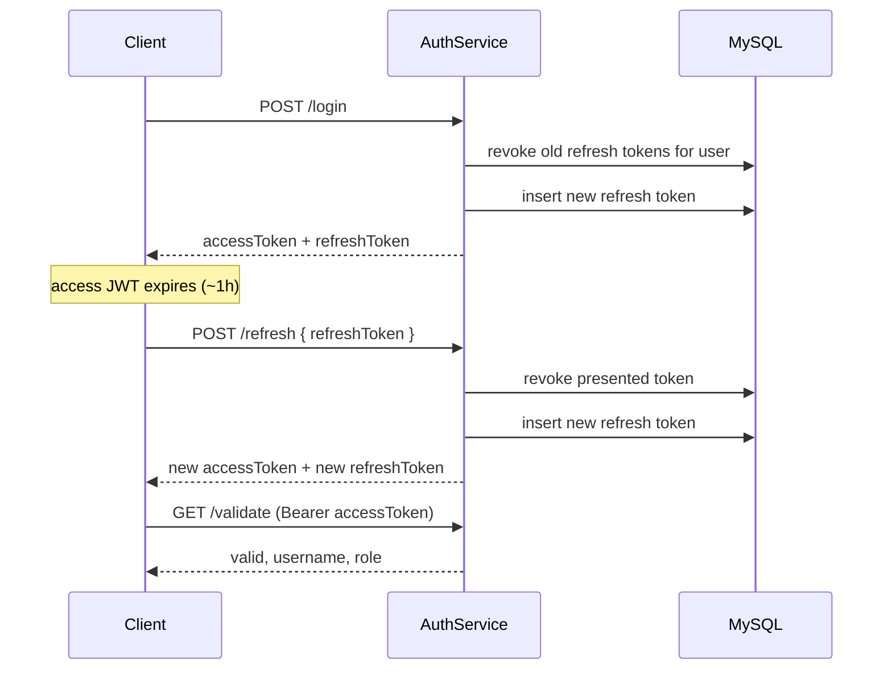

# AuthService

Stateless JWT authentication for the commerce platform. All paths below assume you are in this folder:

```bash
cd AuthService
```

**Prerequisites (all scenarios):** JDK 25, Maven 3.9+, MySQL 8.

Default DB connection (IntelliJ / `application.yml`): `localhost:3306`, database `commerce_platform`, user `vincent`, password `1q2w3e4R`.

---

## 1. Git clone → run in IntelliJ (local)

### One-time: MySQL on your machine

```bash
# Create database (if it does not exist)
mysql -u root -p -e "CREATE DATABASE IF NOT EXISTS commerce_platform;"

# Schema + sample users (password for all users: 123456)
mysql -u vincent -p commerce_platform < sql/init.sql
```

If you previously imported an old seed with invalid password hashes:

```bash
mysql -u vincent -p commerce_platform < scripts/update-user-passwords.sql
```

### One-time: JWT keys

```bash
chmod +x scripts/generate-rsa-keys.sh
./scripts/generate-rsa-keys.sh
```

### Run in IntelliJ

1. Open the repo in IntelliJ (import `AuthService/pom.xml` as a Maven module, or open the root aggregator `pom.xml`).
2. Set Project SDK to **JDK 25**.
3. Run `com.vincent.authservice.AuthServiceApplication` (main class).
4. Default URL: http://localhost:8080

Quick check:

```bash
curl -s http://localhost:8080/api/v1/auth/health

# Full token flow (login → refresh → validate)
LOGIN=$(curl -s -X POST http://localhost:8080/api/v1/auth/login \
  -H 'Content-Type: application/json' \
  -d '{"username":"vincent","password":"123456"}')
ACCESS=$(echo "$LOGIN" | jq -r .accessToken)
REFRESH=$(echo "$LOGIN" | jq -r .refreshToken)
REFRESHED=$(curl -s -X POST http://localhost:8080/api/v1/auth/refresh \
  -H 'Content-Type: application/json' \
  -d "{\"refreshToken\":\"$REFRESH\"}")
ACCESS=$(echo "$REFRESHED" | jq -r .accessToken)
curl -s http://localhost:8080/api/v1/auth/validate -H "Authorization: Bearer $ACCESS"
```

Or from terminal instead of the IDE:

```bash
mvn spring-boot:run
```

---

## 2. Git clone → run with Docker (MySQL on host)

MySQL stays on your Ubuntu host; the container uses `host.docker.internal` (see `scripts/docker-run.sh`).

### One-time: allow Docker to use MySQL user `vincent`

```bash
sudo mysql < scripts/grant-mysql-docker-access.sql
```

### Build and run

```bash
chmod +x scripts/docker-run.sh scripts/generate-rsa-keys.sh
./scripts/generate-rsa-keys.sh
./scripts/docker-run.sh
```

`docker-run.sh` removes any existing `auth-service` container and `auth-service:1.0.0` image, runs `mvn -DskipTests package`, rebuilds the image, then starts the container. Override names with `AUTH_SERVICE_CONTAINER` / `AUTH_SERVICE_IMAGE` if needed.

```bash
# Manual build only (optional)
mvn -DskipTests package
docker build -t auth-service:1.0.0 .
```

Health check: http://localhost:8080/api/v1/auth/health

---

## 3. Git clone → deploy to Minikube and test

Assumes **MySQL on the host** (same as above) and **Minikube** installed.

### One-time

```bash
minikube start
sudo mysql < scripts/grant-mysql-docker-access.sql
chmod +x scripts/minikube-deploy.sh scripts/minikube-uninstall.sh
```

### Deploy (uninstall + build + apply — single command)

```bash
./scripts/minikube-deploy.sh
```

Teardown only (optional):

```bash
./scripts/minikube-uninstall.sh
```

### Test

Get a URL:

```bash
minikube service auth-service --url
```

Or port-forward:

```bash
kubectl port-forward svc/auth-service 8080:80
```

Then (replace host if using `minikube service` URL):

```bash
# Health
curl -s http://localhost:8080/api/v1/auth/health

# Login (saves accessToken + refreshToken in the JSON response)
curl -s -X POST http://localhost:8080/api/v1/auth/login \
  -H 'Content-Type: application/json' \
  -d '{"username":"vincent","password":"123456"}'

# Refresh (paste refreshToken from login; response includes a NEW refreshToken)
curl -s -X POST http://localhost:8080/api/v1/auth/refresh \
  -H 'Content-Type: application/json' \
  -d '{"refreshToken":"<refreshToken>"}'

# Validate (paste accessToken from login or refresh)
curl -s http://localhost:8080/api/v1/auth/validate \
  -H "Authorization: Bearer <accessToken>"
```

Postman collection (optional): `../postman/cloud-ai-commerce-platform.postman_collection.json`

More detail: [k8s/minikube/README.md](k8s/minikube/README.md)

---

## 4. Main API endpoints

| Method | Path | Auth | Description |
|--------|------|------|-------------|
| `GET` | `/api/v1/auth/health` | No | Service health `{ "status": "UP" }` |
| `POST` | `/api/v1/auth/login` | No | Body: `{ "username", "password" }` → access + refresh tokens |
| `POST` | `/api/v1/auth/refresh` | No | Body: `{ "refreshToken" }` → new access + refresh tokens (rotation) |
| `GET` | `/api/v1/auth/validate` | Bearer token | Validates JWT, returns user + role |

**Login** request example:

```json
{ "username": "vincent", "password": "123456" }
```

**Login** response example:

```json
{
  "accessToken": "<jwt>",
  "tokenType": "Bearer",
  "expiresIn": 3600,
  "refreshToken": "<opaque>",
  "refreshExpiresIn": 604800,
  "username": "vincent",
  "role": "USER"
}
```

**Refresh** request example:

```json
{ "refreshToken": "<opaque from login>" }
```

Returns the same shape as login. Each refresh revokes the presented refresh token and issues a new pair.

**Validate** header:

```http
Authorization: Bearer <accessToken>
```

### Refresh token flow

Two token types are issued on login:

| Token | Format | Lifetime (default) | Use |
|-------|--------|-------------------|-----|
| **Access** | RS256 JWT | 1 hour (`JWT_EXPIRATION_SECONDS`) | `Authorization: Bearer …` on protected APIs |
| **Refresh** | Opaque string (stored in MySQL `refresh_tokens`) | 7 days (`JWT_REFRESH_EXPIRATION_SECONDS`) | Body of `POST /api/v1/auth/refresh` only |



**Rules:**

- **Rotation:** each successful refresh invalidates the refresh token you sent; you must store the new `refreshToken` from the response.
- **Reuse:** calling refresh again with an old refresh token returns `401` (`Invalid refresh token`).
- **Re-login:** a new login revokes all active refresh tokens for that user (single active session per login policy).
- **No Bearer on refresh:** send only JSON `{ "refreshToken": "…" }`; the endpoint is public.

**When access token expires:** call `/refresh` with the latest `refreshToken` — do not log in again unless the refresh token is expired or revoked.

**Configuration** (`application.yml` / env):

| Property | Env var | Default |
|----------|---------|---------|
| `app.jwt.expiration-seconds` | `JWT_EXPIRATION_SECONDS` | `3600` |
| `app.jwt.refresh-expiration-seconds` | `JWT_REFRESH_EXPIRATION_SECONDS` | `604800` (7 days) |

---

## 5. Swagger UI

With the app running (IntelliJ, Docker, or Minikube port-forward):

http://localhost:8080/swagger-ui.html

OpenAPI JSON: http://localhost:8080/v3/api-docs

---

## 6. Passwords and sample users

### Sample users (after `sql/init.sql`)

| Username | Password | Role |
|----------|----------|------|
| vincent | 123456 | USER |
| admin | 123456 | ADMIN |
| tester | 123456 | USER |

### Generate a BCrypt hash (for new SQL seed data)

```bash
mvn -q exec:java \
  -Dexec.mainClass=com.vincent.authservice.util.PasswordHashGenerator \
  -Dexec.args=your-password
```

Use the printed hash in `INSERT` statements for the `users.password` column.

---

## 7. Tests and coverage

From `AuthService/`:

```bash
mvn test verify
```

- **Unit tests:** `AuthServiceTest`, `RefreshTokenServiceTest`, `JwtServiceTest`, `AuthControllerTest`, `GlobalExceptionHandlerTest`, …
- **Integration tests:** `AuthApiIntegrationTest` (login, refresh rotation, validate, error paths)

JaCoCo report (line coverage gate ≥ 85%):

```bash
# HTML report
xdg-open target/site/jacoco/index.html   # Linux
open target/site/jacoco/index.html       # macOS
```

Refresh-related coverage includes: token issue/revoke/rotate in `RefreshTokenService`, login + refresh orchestration in `AuthService`, and HTTP flows in `AuthApiIntegrationTest`.

---

## 8. Postman (refresh token)

Collection: `../postman/cloud-ai-commerce-platform.postman_collection.json`

1. Import collection (+ optional `../postman/cloud-ai-commerce-platform.local.postman_environment.json`).
2. Run **Auth Service → Login** — saves `accessToken` and `refreshToken` to collection/environment variables.
3. Run **Auth Service → Refresh Token** — rotates tokens and updates both variables (use this when the JWT expires).
4. Run **Validate Token** — uses the current `accessToken` from step 2 or 3.

See repository root [README.md](../README.md#postman) for import steps.
